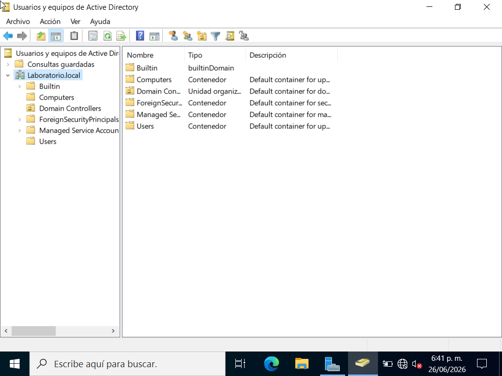
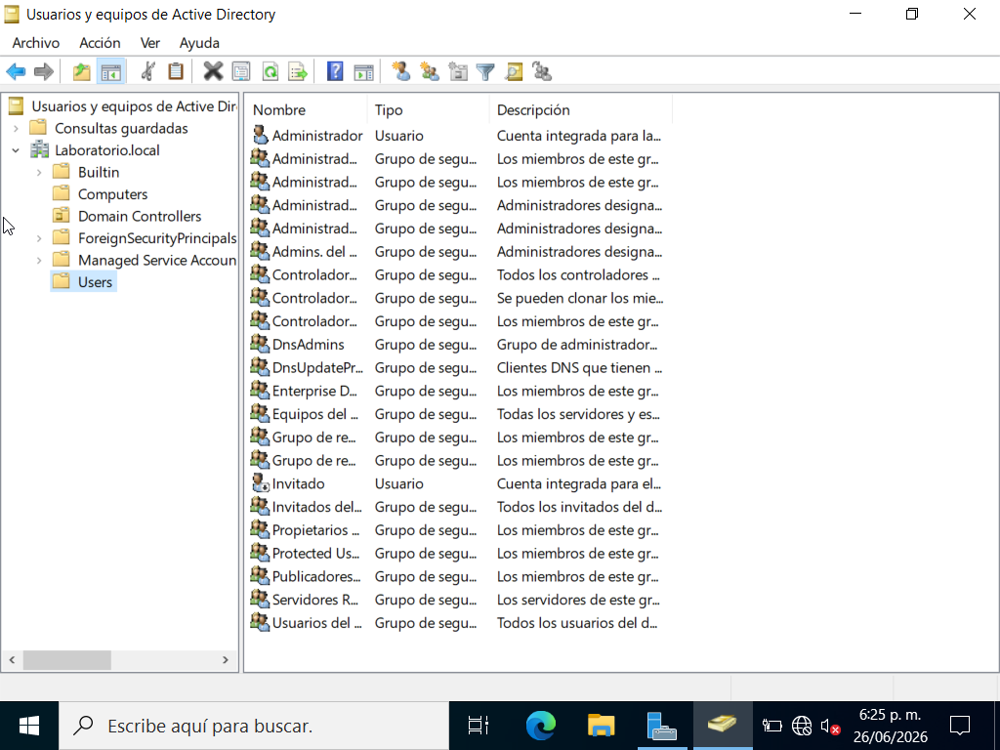
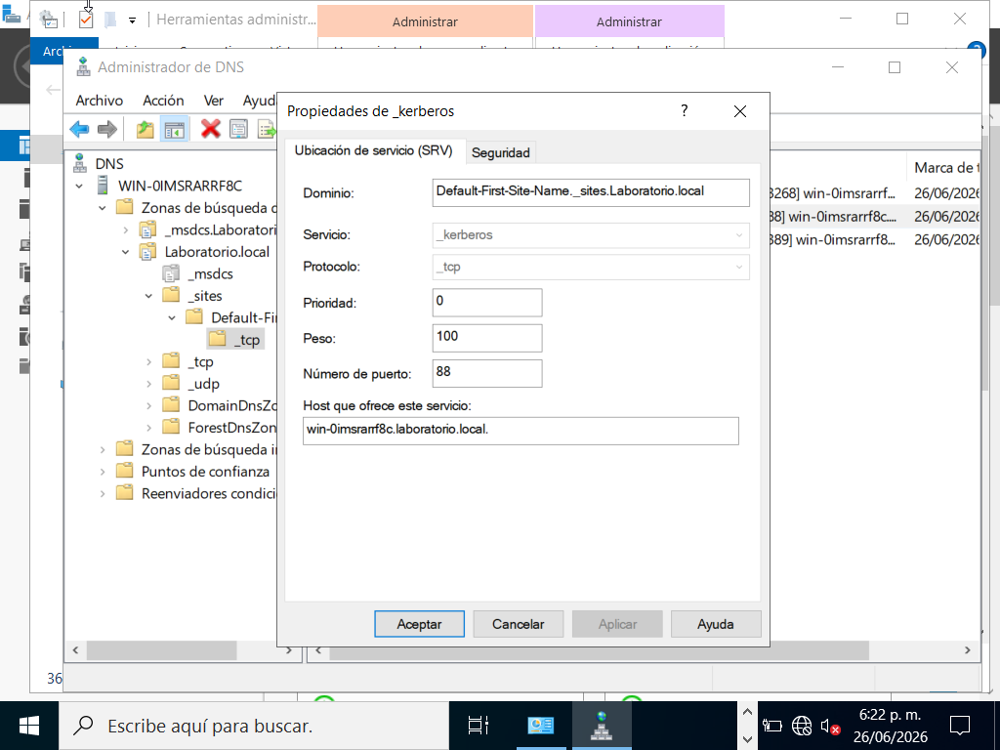
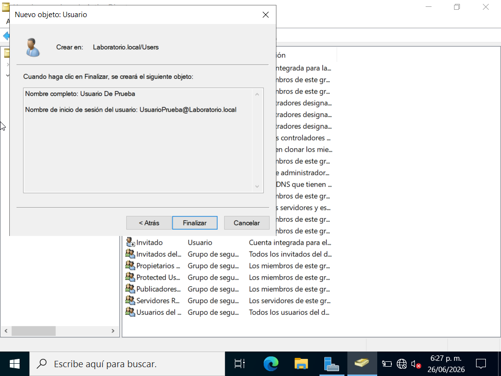

# Semana 1 — Fundamentos IAM + Primer Domain Controller

## Objetivo de la semana
Sentar las bases teóricas de IAM (AuthN/AuthZ, RBAC, ABAC, Least Privilege, 
Zero Trust) y construir el primer Domain Controller del lab.

## Qué hice

- Repasé AuthN vs AuthZ y los 3 principios de Zero Trust aplicados a IAM
- Estudié RBAC, ABAC y Least Privilege como base para el diseño de grupos en AD
- Instalé Windows Server 2022 (Desktop Experience) en la VM DC1
- Configuré IP estática: 192.168.1.10 / 255.255.255.0, DNS apuntando a sí mismo
- Instalé el rol Active Directory Domain Services
- Promoví el servidor a Domain Controller — nuevo forest: `lab.local`
- Exploré DNS Manager: zona lab.local, carpetas _msdcs, _sites, _tcp, _udp
- Encontré el SRV record _kerberos en _tcp
- Creé el primer usuario de prueba en AD Users and Computers

## Qué aprendí

- La diferencia entre autenticación y autorización en el flujo real de AD 
  (Kerberos = AuthN, ACLs/GPOs = AuthZ)
- Por qué AD depende completamente de DNS para funcionar (SRV records)
- Cómo aplicar Least Privilege al diseño de grupos antes de crearlos
- Para qué sirve la contraseña DSRM y cuándo se usa

## Problema que resolví

Sin incidentes — instalación y promoción 
del DC funcionaron en el primer intento.

## Evidencia
## Evidencia

<table border="0">
  <tr>
    <td align="center" valign="top" width="50%">
      <figure>
        
        <figcaption><b>DC instalado</b></figcaption>
      </figure>
    </td>
    <td align="center" valign="top" width="50%">
      <figure>
        
        <figcaption><b>AD Users and Computers</b></figcaption>
      </figure>
    </td>
  </tr>
  <tr>
    <td align="center" valign="top" width="50%">
      <figure>
        
        <figcaption><b>DNS Manager</b></figcaption>
      </figure>
    </td>
    <td align="center" valign="top" width="50%">
      <figure>
        
        <figcaption><b>Usuario de prueba</b></figcaption>
      </figure>
    </td>
  </tr>
</table>

